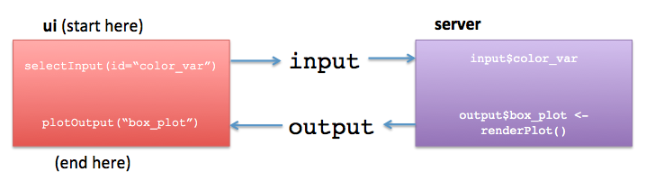

# Introduction

## Setup

1) Make sure that you have the following packages installed:


```r
install.packages(c("shiny", "tidyverse", "fivethirtyeight", "plotly"))
```

2) Clone or download the tutorial from here (click the `Clone or Download` button, it's green and on the right side): https://github.com/laderast/gradual_shiny 

3) Unzip, and open the `gradual_shiny.Rproj` file in this folder. The project should open in RStudio and you should be ready!

## Introducing Shiny

Welcome to Shiny! Shiny is a framework in R for making interactive visualizations for the web created by Joe Cheng. Nearly any plot in R can be made into an interactive visualization by adding some simple interface elements and mapping these interface elements into the plot. It's an extremely powerful technique for visualization and communication of findings.

Before we get started, we need to talk a little bit about the architecture of `shiny` apps. `shiny` apps are *server-based*, which means that all of the calculations and plot rendering happen on a server (when you're running them in RStudio, your server is your computer). Compare this to JavaScript visualization frameworks such as `D3.js`, where the client's computer needs to do all of the computing of the visualization. 

There are a lot of benefits to server-based frameworks, namely that your users don't need to have a heavy-duty computer to visit your site, and that your data is sitting behind a protected server. One of the difficulties is that it can be difficult to scale for lots of users.

## The concept of `ui` and `server` elements

Every shiny app has two elements. The first is `ui`, which handles both the user controls and the layout and placement of output elements, such as plots or tables. `ui` usually consists of a layout scheme, with user controls (such as sliders, select boxes, radio boxes, etc) specified here. The second element is `server`, which handles all of the calculations and the generation of plots for `ui`. 

`ui` and `server` are only connected by two objects `input`, and `output` (they actually are environments, but we'll just say they are objects). `ui` puts the values from the controls into `input`, which can be accessed by `server`. For example, if we have a slider called `year_release` in `ui`, we can access the value of that slider in `server` through `input$year_release`. 

`server` will then do something with the slider value and generate some output. Where does it put the output? If you guessed `output`, then give yourself a star! `ui` then takes `output` and will then display it using the various _Output functions (such as `plotOutput`, `textOutput` and`tableOutput`).

If this is confusing, go very carefully through the diagram below. I'm happy to answer any questions you have about it.


