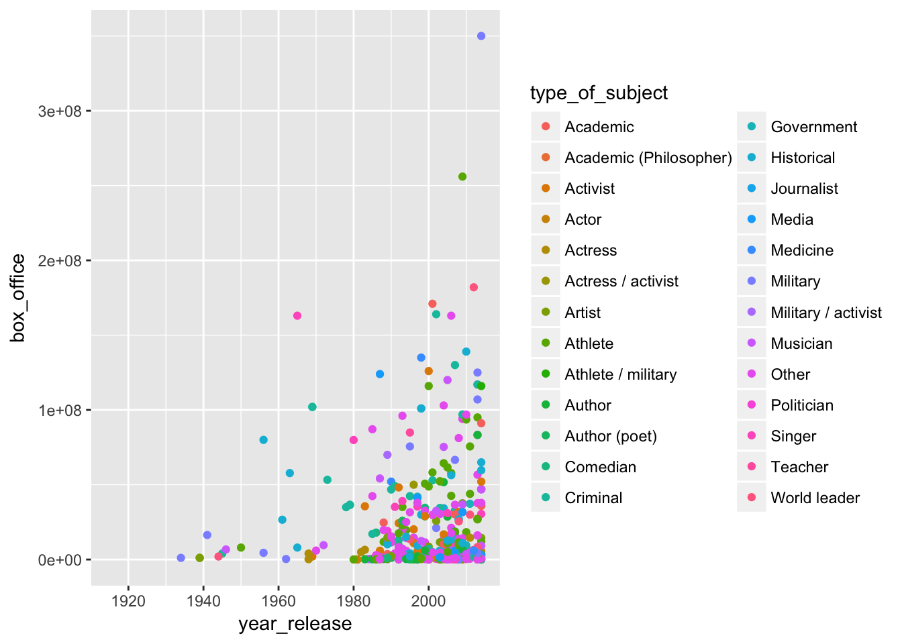
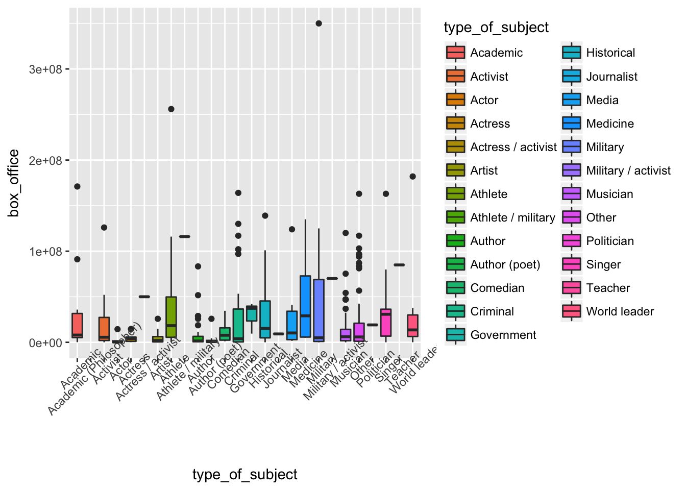

# App 1: Connecting `ui` and `server`

We'll be taking two simple `ggplot2` graphs and turning them into part of an interactive dashboard. The data we're going to use is the `biopics` dataset from the `fivethirtyeight` package. 

## Making two plots interactive

The first visualization is a scatterplot visualizing the total `box_office` by `year_release`, colored by `type_of_subject`. For the interactive portion, we're going to color each point by different categories. Notice we use `aes_string()` to map columns to aesthetics. This is important, since we'll be passing `character` arguments to modify this plot later.


```r
library(tidyverse)
library(fivethirtyeight)
data(biopics)

biopics %>% ggplot(aes_string(y="box_office", x="year_release", color = "type_of_subject")) +
        geom_point()
```



The second visualization is going to be a boxplot of `box_office` by category:


```r
biopics %>% ggplot(aes_string(x="type_of_subject", y="box_office", 
                                   fill="type_of_subject")) +
  geom_boxplot() + theme(axis.text.x = element_text(angle=45))
```



## Exercise

1. Open the `01_app_basics` folder and open the `app.R` file. This is the file for the Shiny App and we'll modify it.

2. Look at the structure of the code. There are two objects that we define: `ui` and `server`. We make them into an app with the command `shinyApp(ui = ui, server = server)`.

3. Take a look at the `server` code. Notice where our `ggplot2` code is. Both graphs are placed in a `renderPlot()` function, and we give them a place in `output`, so `ui` can "see" it. The scatterplot is named `output$scatter_plot` and the boxplot is named `output$boxoffice_boxplot`. 

4. Take a look at the `ui` code. Where in the code are we displaying `scatter_plot` and `boxoffice_boxplot`? Notice we don't need to refer to `output`. The display function `plotOutput` knows to look in the `output` object.

5. Run the code by clicking the "Run App" button on the top of code window. You can see that we output our graphs in the "main" window.

6. Let's paste in a control. Paste the following code where it says "Add User Interface Element here" in `app.R`. If you run the app again, you should see a control, but it doesn't change the plot.

```
selectInput("color_opts", "Select Category to Color With",
        choices = select_color_options)
```

7. Let's connect the control to the plot. Change the `color` aesthetic to the following:

```
color = input$color_opts
```

8. Now try running the app. Your select box should control what categorical data controls the color of the points. Try it out!

9. Bonus! Let's add in another category option. Where should you add it? Just in case, here are the column names and their data types. You probably shouldn't add `title`, `director`, `subject`, `lead_actor_actress` since they aren't really categories, and they will blow up your `ggplot`s.


```r
glimpse(biopics)
```

```
## Observations: 761
## Variables: 14
## $ title              <chr> "10 Rillington Place", "12 Years a Slave", ...
## $ site               <chr> "tt0066730", "tt2024544", "tt1542344", "tt2...
## $ country            <chr> "UK", "US/UK", "US/UK", "Canada", "US", "US...
## $ year_release       <int> 1971, 2013, 2010, 2014, 1998, 2008, 2002, 2...
## $ box_office         <dbl> NA, 5.67e+07, 1.83e+07, NA, 5.37e+05, 8.12e...
## $ director           <chr> "Richard Fleischer", "Steve McQueen", "Dann...
## $ number_of_subjects <int> 1, 1, 1, 1, 1, 1, 1, 1, 1, 2, 2, 1, 3, 3, 3...
## $ subject            <chr> "John Christie", "Solomon Northup", "Aron R...
## $ type_of_subject    <chr> "Criminal", "Other", "Athlete", "Other", "O...
## $ race_known         <chr> "Unknown", "Known", "Unknown", "Known", "Un...
## $ subject_race       <chr> NA, "African American", NA, "White", NA, "A...
## $ person_of_color    <lgl> FALSE, TRUE, FALSE, FALSE, FALSE, TRUE, FAL...
## $ subject_sex        <chr> "Male", "Male", "Male", "Male", "Male", "Ma...
## $ lead_actor_actress <chr> "Richard Attenborough", "Chiwetel Ejiofor",...
```

## What you've learned so far

+   The architecture of shiny apps
+   How `ui` and `server` communicate through `output` and `input`
+   How `ui` displays plots (using `plotOutput`)
+   Adding a control (a `selectInput`)
+   Connecting that control to our `plots` using `input`

## For More Info
