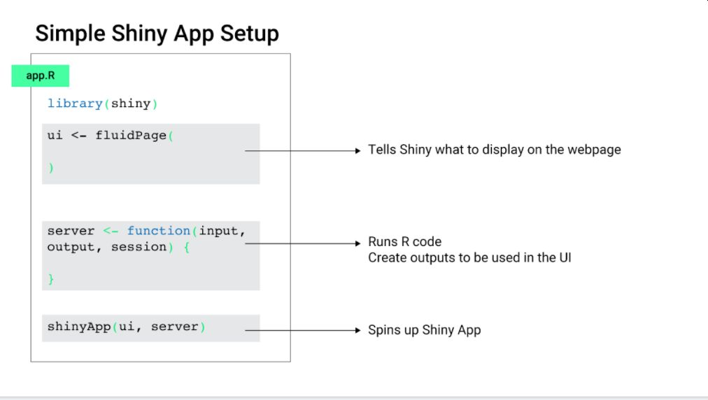
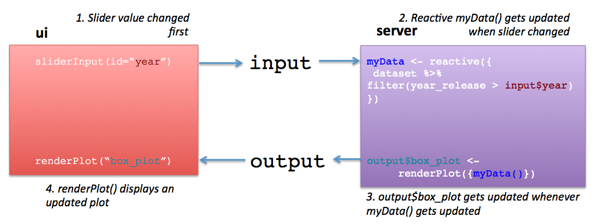

```{r xaringan-themer, include = FALSE}
library(xaringanthemer)
style_mono_accent(
  base_color = "midnightblue",
  header_font_google = google_font("Josefin Sans"),
  link_color = "steelblue",
  text_font_size = "24px",
  footnote_font_size = "20px"
)
```

```{r xaringanExtra, echo=FALSE}
xaringanExtra::use_xaringan_extra(c("tile_view", "logo", "tachyons"))
xaringanExtra::use_panelset()
xaringanExtra::use_tachyons()
```

```{r setup, include=FALSE}
options(htmltools.dir.version = FALSE)
library(flair)
library(shiny)
categoricalVars <- c("country", 
                     "type_of_subject", 
                     "subject_race", 
                     "subject_sex")
library(fivethirtyeight)
library(ggplot2)
library(plotly)
data(biopics)
```

```{css, echo=FALSE}
.tiny .remark-code { /*Change made here*/
  font-size: 80% !important;
}

```
---

class: center, middle
# Welcome and Logistics

---
class: center, middle
# Where are these slides?

## http://bit.ly/bdc_shiny_slides

---
# BioData Club Code of Conduct

This workshop is governed by the [BioData Club Code of Conduct](https://biodata-club.github.io/code_of_conduct/).

This workshop is meant to be a psychologically safe space where it's ok to ask questions.

I want to normalize your own curiosity and fuel your desire to learn more.

If you are disruptive to class learning or disparaging to other students, I may mute you for the day.

.footnote[https://bit.ly/bdc_shiny_slides]
---
# Ted Laderas, PhD

.pull-left[
- Bioinformatics Trainer, DNAnexus
- Certified RStudio/Carpentries Instructor
- Co-founder of
  - [BioData Club](http://biodata-club.github.io)
  - [Cascadia-R Conference](https://cascadiarconf.com)
- https://laderast.github.io 
]
.pull-right[

]

---
# Workshop TA

- Martin Monkman

.bg-washed-green.b--dark-green.ba.bw2.br3.shadow-5.ph4.mt5[
    If you have any questions you don't want to ask me, you can message Kate privately.
]

---
# Introduce Yourself in Chat

- Your Name
- Affiliation
- What you hope to learn in today's workshop

---
# What is Shiny?

.pull-left[
- A web based framework for interactive visuals
- Developed by Joe Cheng and RStudio
- Server based: requires an installation of R to work
]

.pull-right[
```{r echo=FALSE}
knitr::include_graphics("image/shiny.png")
```

]

.footnote[https://bit.ly/bdc_shiny_slides]
---
# Why Shiny?

- Interactive figures that help users explore data
- Dashboards for showing people summaries of data
- Widely Used
- Leverages R and its visualization tools

.footnote[https://bit.ly/bdc_shiny_slides]
---
class: center, middle

# Getting to know basic shiny app architecture

---



Illustration: Vivian Peng

.footnote[https://bit.ly/bdc_shiny_slides]
---
# 1.1 Minimal Shiny App


.pull-left.tiny[
##ui
```{r ui_min, eval=FALSE, include=FALSE}
ui <- fluidPage()
```

```{r echo=FALSE}
decorate("ui_min") %>%
  flair("()", background="#cdecff") 
```

- note that `fluidPage` is a `function`
- uses .bg-lightest-blue[`()`], so arguments need to be comma separated
  
]

.pull-right.tiny[
##server
```{r server_min, eval=FALSE, include=FALSE}
server <- function(input, output) {}
```

```{r echo=FALSE}
decorate("server_min") %>%
  flair("{}", background="#ffb700")
```

- Note that `server` defines a new function
- Uses .bg-gold[{}] (curly brackets), so code is separated by line

]

```{r eval=FALSE}
shinyApp(ui = ui, server = server)
```

.footnote[https://bit.ly/bdc_shiny_slides]
---
# `input` and `output` are how `ui` and `server` communicate

- `ui` and `server` are continuously running and listening to each other
- `ui`: listens to `output` and puts info into `input` 
    - passes on information on state of controls into `input` (`input$my_slider`)
    - listens to `output` for generated plots and tables and changes
- `server`: listens to `input` and puts info into `output`
    - passes on plots and tables into `output` (`output$my_plot`)
    - listens to `input` for changes in controls

.footnote[https://bit.ly/bdc_shiny_slides]
---
# `biopics` dataset

```{r echo=FALSE}
knitr::kable(biopics[1:5,])

```

---
class: center, middle

# 1.2 Adding a Plot to our App

---
## Let's Add This Plot

.pull-left[
.tiny[
```{r aes1, eval=FALSE, include=FALSE}
my_plot <-  ggplot(biopics) + 
      aes(
        x=year_release, 
        y=box_office, 
        color= type_of_subject) +
      geom_point()
```

```{r echo=FALSE}
decorate("aes1") %>%
   flair("aes", background="#ffb700")
```

- We use .bg-gold[`aes()`] here
- Makes things a little difficult when we wire a control in
]
]

.pull-right[
.tiny[
```{r echo=FALSE, warning=FALSE}
    ggplot(biopics) + 
      aes(x=year_release, 
          y=box_office, 
          color= type_of_subject) +
      geom_point()
```
]
]

---
# Adding a plot: plotOutput and renderPlot

```{r uibasic2, include=FALSE, eval=FALSE}
ui <- fluidPage(
  plotOutput("movie_plot")
)
```


```{r serverbasic2, include=FALSE, eval=FALSE}
server <- function(input, output) {

 output$movie_plot <- renderPlot({

   
   
   
})

}

```

.pull-left.tiny[
```{r, echo=FALSE}
decorate("uibasic2") %>% 
  flair("movie_plot", background="#cdecff") %>%
  flair("plotOutput", background = "#ffb700")

```

- for `ui`, need to add a .bg-gold[`plotOutput()`] to display the plot
- note the argument .bg-lightest-blue[`"movie_plot"`]
]

.pull-right.tiny[
```{r, echo=FALSE}
decorate("serverbasic2") %>% 
  flair("movie_plot", background="#cdecff") %>%
  flair("renderPlot({", background="#ffb700") %>%
  flair("})", background="#ffb700")

```
- for `server`, need to add a .bg-gold[`renderPlot()`] to generate the plot
- assign into .bg-lightest-blue[`output$movie_plot`] so `ui` can display it

]


---
# Adding our ggplot code

```{r uibasic, include=FALSE, eval=FALSE}
ui <- fluidPage(
  plotOutput("movie_plot")
)
```


```{r serverbasic, include=FALSE, eval=FALSE}
server <- function(input, output) {

 output$movie_plot <- renderPlot({

  ggplot(biopics) + 
    aes(x=year_release, 
        y=box_office, 
        color= type_of_subject) +
    geom_point()

})

}

```

.pull-left.tiny[
```{r, echo=FALSE}
decorate("uibasic") %>% 
  flair("movie_plot", background="#cdecff")

```

]

.pull-right.tiny[
```{r, echo=FALSE}
decorate("serverbasic") %>% 
  flair("movie_plot", background="#cdecff") %>%
  flair_lines(5:9)

```

- Now we add our .bg-light-yellow[`ggplot()`] statement in
]

---
class: center, middle

# 1.3 Let's Add a Control

---
# selectInput

.pull-left.tiny[
```{r selbox, eval=FALSE}
selectInput(
  inputId = "color_select", 
  label = "Select Categorical Variable", 
  choices = categoricalVars
  )
```
]

.pull-right.tiny[
`r knitr::include_graphics("image/selectInput.jpg")`
]

- Want to control the variable we **color** with the `selectInput()` control!

---
# Adding the selectInput

```{r ui2, include=FALSE, eval=FALSE}
ui <- fluidPage(
  plotOutput("movie_plot"),
  selectInput(
    inputId = "color_select", 
    label = "Select Categorical Variable", 
    choices = categoricalVars)
)
```


```{r server2, include=FALSE, eval=FALSE}
server <- function(input, output) {

  output$movie_plot <- renderPlot({

    ggplot(biopics) +
    aes(x=year_release, 
        y=box_office, 
        color=type_of_subject) +

      geom_point()
  })

}
```

.pull-left.tiny[
```{r, echo=FALSE}
decorate("ui2") %>% 
  flair_lines(3:6)

```

- Here we add the .bg-light-yellow[`selectInput()`] control
- Note the comma after `plotOutput("movie_plot")`
]

.pull-right.tiny[
```{r, echo=FALSE}
decorate("server2") %>%
  flair('color=type_of_subject')
```
]

---
# Wiring in the Input

.pull-left.tiny[
```{r, echo=FALSE}
decorate("ui2") %>% 
  flair("color_select", background = "#cdecff") %>%
  flair("selectInput", background = "#fbf1a9")

```
]

.pull-right[

```{r server3, eval=FALSE}
server <- function(input, output) {

  output$movie_plot <- renderPlot({

    ggplot(biopics) +
    aes(x=year_release, 
        y=box_office, 
        color= .data[[input$color_select]] ) +

      geom_point()
  })

}
```

```{r, echo=FALSE, eval=FALSE}
decorate("server3") %>% 
  flair("color_select", background = "#cdecff")

```

- connect our .bg-light-yellow[`selectInput`] to our `ggplot`
- use .bg-lightest-blue[`.data[[input$color_select]]`] as argument to `color` in `aes_string()`
]

---
# The Flow: from `selectInput()` to `plotOutput()`


---
# Why do we use `.data[[]]` (Data Masking)?

- Need a way of taking our `selectInput` value (`character`) and use it to refer to the column name in the data
- `.data` is how we refer to the dataset in use in a `tidyverse` workflow 
- Hence, `.data[[input$color_select]]`
- More info here: https://mastering-shiny.org/action-tidy.html#data-masking

---
class: center, middle

# Let's open `01_app_basics.Rmd`

---
class: center, middle

# 02: Making Data Reactive



---
# Making a Dataset Filterable

```{r filter, include=FALSE, eval=FALSE}
biopics[1:5, 1:5] %>%
  filter(year_release > 1917)
```

```{r echo=FALSE}
decorate("filter") %>%
  flair("filter", background = "#ffb700")
```

- We want to make this .bg-gold[`filter()`] statement dynamic
- Move a slider, and change the year
- We'll need to put it in a `reactive` expression

---
# Making your data listen

```{r reactive1, eval=FALSE, include=FALSE}
biopics_filtered <- reactive({
    
      biopics %>%
        filter(year_release > input$year_filter)
    
  })
```

```{r echo=FALSE}
decorate("reactive1") %>%
  flair("reactive({", background="#ffb700") %>%
  flair("})", background="#ffb700") %>%
  flair("input$year_filter", background="#cdecff")
```

- **reactive** expressions listen to changes in .bg-lightest-blue[`input`]
- started with a .bg-gold[`reactive({})`]
- The curly brackets in .bg-gold[`reactive({})`] let us use more than one line of code `{}`
---
# Reactive Flow: from slider to data to plot


---
# Adding our control: sliderInput()

.pull-left.tiny[
```{r eval=FALSE}
sliderInput(inputId = "year_filter", 
            "Select Lowest Year", 
            min = 1915,
            max=2014, 
            value = 1915)

```
]

.pull-right.tiny[


]

---
# Adding sliderInput (in `ui`)

```{r slider_ui, eval=FALSE, include=FALSE}
ui <- fluidPage(
   
      plotOutput("movie_plot"),
      sliderInput("year_filter", 
                  "Select Lowest Year", 
                  min = 1915,
                  max=2014, 
                  value = 1915)
)
```

```{r echo=FALSE}
decorate("slider_ui") %>%
  flair_lines(4:8)
```

- Don't forget the comma after `plotOutput("movie_plot")`!

---
# Using our Reactive (in `server`)

```{r reactive2, include=FALSE, eval=FALSE}
biopics_filtered <- reactive({
    biopics %>%
        filter(year_release > 
                 input$year_filter)
     })

```

```{r reactive3, include=FALSE, eval=FALSE}
renderPlot({
  
  ggplot(biopics_filtered()) + 
  
  aes_string(y="box_office", 
             x="year_release") + 
      
  geom_point()
     
})

```

.pull-left.tiny[
```{r, echo=FALSE}
decorate("reactive2") %>%
  flair("biopics_filtered", background="#ffb700")

```
]

.pull-right.tiny[
```{r, echo=FALSE}
decorate("reactive3") %>%
  flair("biopics_filtered()", background="#ffb700")

```
]

---
# A Tip

- Always call reactives with the `()` 
- Example: `biopics_filtered()`

---
# Required Input: the `req()` function

```{r reactive4, include=FALSE, eval=FALSE}
biopics_filtered <- reactive({
    req(input$year_filter)
  
    biopics %>%
        filter(year_release > 
                 input$year_filter)
     })

```

- If `input$year_filter` is not specified, then reactive will not work
- Use the `req()` function to **require** `input$year_filter`. 

---
class: center, middle

# Let's open 02_reactives.Rmd in RStudio.cloud

---
class: center, middle

# 03: Adding Tooltips with `{plotly}`

---
# What is {plotly}?

- A JavaScript library that makes your interactive plots more interactive.
- accessed with the `{plotly}` package in R

---
# Making a ggplot into a plotly plot

```{r plotly2, eval=FALSE, include=FALSE}
my_plot <- ggplot(biopics) +
  aes(x =box_office, 
      y=year_release,
      color=subject) +
  geom_point()

#ggplotly(my_plot)
```

.pull-left.tiny[
```{r echo=FALSE}
decorate("plotly2") %>%
  flair("my_plot", background = "#cdecff") %>%
  flair("ggplotly(", background = "#ffb700")
```

- assign our plot to .bg-lightest-blue[`my_plot`]
- run .bg-gold[`ggplotly()`] on .bg-lightest-blue[`my_plot`]
]

.pull-right.tiny[
```{r echo=FALSE, warning=FALSE}
my_plot <- ggplot(biopics) +
  aes(x=box_office, 
      y=year_release,
      color=type_of_subject) +
  geom_point() +
  theme(legend.position="none")

ggplotly(my_plot)
```
]
---
# Adding more tooltip information

```{r plotly1, eval=FALSE, include=FALSE}
my_plot <- ggplot(biopics) +
  aes(x =box_office, 
       y=year_release,
       title=title,
       color=type_of_subject,
       director=director,
       box_office=box_office, 
       subject=subject) +
  geom_point()

#ggplotly(my_plot)
```


.pull-left.tiny[
```{r echo=FALSE}
decorate("plotly1") %>%
  flair_lines(4:8)
```

- add to `aes()`
]

.pull-right.tiny[
```{r echo=FALSE, warning=FALSE}
my_plot <- ggplot(biopics) +
  aes(x =box_office, 
      y=year_release,
      color=type_of_subject,
      title=title,
      director=director,
      box_office=box_office, 
      subject=subject) +
  geom_point() +
  theme(legend.position="none")

ggplotly(my_plot)
```
]


---
# Adding to our app - make these changes

.pull-left.tiny[## in `ui`:

Change

```
plotOutput()
```
to

```
plotlyOutput()
```
]

.pull-right.tiny[## in `server`:
Change

```
renderPlot()
```

to

```
renderPlotly()
```

]

---
# Modified App for `plotly` tooltips

```{r ui_plotly, include=FALSE, eval=FALSE}
ui <- fluidPage(
  plotlyOutput("movie_plot"),
  selectInput(inputId = "color_select", 
              label = "Select Categorical Variable", 
              choices = categoricalVars)
)
```

```{r, server_plotly, include=FALSE, eval=FALSE}
server <- function(input, output) {
  
  output$movie_plot <- renderPlotly({
    
    my_plot <- ggplot(biopics) +
      aes(x = box_office, 
          y= year_release,
          color=type_of_subject) +
      geom_point() +
      theme(legend.position="none")
    
    ggplotly(my_plot)
  })
}
```

.pull-left.tiny[
```{r echo=FALSE}
decorate("ui_plotly") %>%
  flair("plotlyOutput", background="#cdecff")
```
]

.pull-right.tiny[
```{r echo=FALSE}
decorate("server_plotly") %>%
  flair("renderPlotly", background="#cdecff") %>%
  flair_lines(5:12)
```
]

---
class: center, middle

# Let's open `03_plotly.Rmd`

---
# `app.R`

We've been running Shiny apps as code blocks so far.

Apps are usually set up in a folder with `app.R`

---
class: center, middle

# Open up `04_full_app/app.R`

---
# Making a new app as a project

In a project, use 

**File > New Project > New Directory > Shiny Web Application**

And then name your app.

---
class: center, middle
# Wrap up and Tips

---
# More about inputs and outputs

Further reading on the different control inputs, and data output types here:

https://laderast.github.io/gradual_shiny/app-1-connecting-ui-and-server.html#more-about-inputs-and-outputs

Shiny Widget Gallery: https://shiny.rstudio.com/gallery/widget-gallery.html

---
# Layouts

Ways to lay out elements of your application:

- `fluidPage` - https://shiny.rstudio.com/articles/layout-guide.html
- `flexdashboard` - https://rmarkdown.rstudio.com/flexdashboard/
    - Requires a slightly different set up for your apps: https://pkgs.rstudio.com/flexdashboard/articles/shiny.html

---
# Extensions

- [Shiny Modules](https://shiny.rstudio.com/articles/modules.html) (allows you to reuse code)
- [HTMLwidgets](https://www.htmlwidgets.org/) - JavaScript visualization libraries made for use with Shiny/RMarkdown
- [r2d3](https://rstudio.github.io/r2d3/) - allows you to use cool visualizations built in d3.js -  

More info here: https://laderast.github.io/gradual_shiny/where-next.html

---
# Shiny in the Real World

- https://shinyapps.io lets you host Shiny apps externally

---
# Deploying Apps on shinyapps.io

- Requires installing `{rsconnect}` package
- When you first try to deploy, it will ask you for your account info
- When you run the app, there is a "Publish" button
- More info about getting your app online here: https://docs.rstudio.com/shinyapps.io/getting-started.html

---
# Shiny Gallery

You should now know enough to start learning from the examples:

- https://shiny.rstudio.com/gallery/
- Look at demos

---
# Going Further

- Try to precompute as many statistics as possible in advance
- Try to work from one `data.frame` if possible
- Learn more about how to dynamically update the `ui` using event handlers
- Look at `htmlwidgets` for possible JavaScript visualizations you can leverage

---
# Suggested Reading

- [Mastering Shiny](https://mastering-shiny.org/) by Hadley Wickham
- [Interactive web-based data visualization with R, plotly, and shiny](https://plotly-r.com/) by Carson Sievert

---
# Acknowledgements

- Biodata Club
- Jessica Minnier
- Pierrette Lo
- Dar'ya Pozhidayeva
- Vivian Peng
- Eric Leung

---
# Keep in Touch

My Web Page: https://laderast.github.io
Twitter: https://twitter.com/tladeras
Email: tedladeras [at] gmail [dot] com

---
class: center, middle

# Questions?